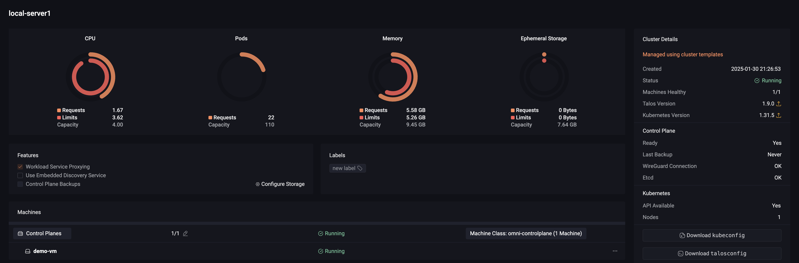

# Siderolabs Omni Example

<p align="center">
  
</p>


This example shows how to manage a Talos Kubernetes cluster with Sidero Labs' Omni.
It deploys a Talos Kubernetes cluster using Omni, with the following tooling:

* ArgoCD for application management
* OpenEBS Mayastor for persistent volume management
* Traefik for ingress
* Metrics Server for Horizontal Pod Autoscaling
* Simple apps + MySQL for testing

## Usfull links:
- [GitHub - SaaS-simple deployment of Kubernetes - on your own hardware.](https://github.com/siderolabs/omni?tab=readme-ov-file)
- [GitHub - A homebrew repo for our talos tap](https://github.com/siderolabs/homebrew-tap)
- [GitHub - Talos: Installing Longhorn on Talos Linux](https://github.com/kwehen/LonghornTalos)
- [GitHub - Siderolabs Omni Example](https://github.com/siderolabs/contrib/tree/main/examples/omni)
- [How to enable workers on your control plane nodes \| Talos Linux](https://www.talos.dev/v1.9/talos-guides/howto/workers-on-controlplane/)
- [Deploying Metrics Server \| Talos Linux](https://www.talos.dev/v1.9/kubernetes-guides/configuration/deploy-metrics-server/)
- [Storage \| Talos Linux](https://www.talos.dev/v1.9/kubernetes-guides/configuration/storage/)

## Prereqs

An [Omni account](https://signup.siderolabs.io/), and some machines registered to it.
How the machines are started and joined to the Omni instance are not covered in this README, but [documentation is available](https://omni.siderolabs.com/tutorials/getting_started).
With the default configuration, a minimum of 6 machines, 3 of which with additional block devices for persistent storage.

This example uses [Machine Classes](https://omni.siderolabs.com/how-to-guides/create-a-machine-class) called `omni-contrib-controlplane` and `omni-contrib-workers`.
How they are defined is entirely dependent on the infrastructure available, they would need to be configured on the Omni instance.

Lastly, `omnictl` the Omni CLI tool would also be needed.
See the [How-to](https://omni.siderolabs.com/how-to-guides/install-and-configure-omnictl) on how to obtain and configure it.

## Usage
Update the ArgoCD ApplicationSet template to reference your new git repo, and regenerate the ArgoCD bootstrap patch.

```bash
sed -i 's|https://github.com/vanelin/omni.git|<your-git-repo>|' apps/argocd/argocd/bootstrap-app-set.yaml
kustomize build apps/argocd/argocd | yq -i 'with(.cluster.inlineManifests.[] | select(.name=="argocd"); .contents=load_str("/dev/stdin"))' infra/patches/argocd.yaml
```

Once the required machines are registered to Omni and machine classes have been configured, simply run
```bash
cd infra
omnictl cluster template sync --file cluster-template.yaml
```

Omni will then being to allocate your machines, install Talos, and configure and bootstrap the cluster.

This setup makes use of the [Omni Workload Proxy](https://omni.siderolabs.com/how-to-guides/expose-an-http-service-from-a-cluster) feature,
which allows access to the HTTP front end services *without* the need of a separate external Ingress Controller or LoadBalancer.
Additionally, it leverages Omni's built-in authentication to protect the services, even those services that don't support authentication themselves.

## Applications

Applications are managed by ArgoCD, and are defined in the `apps` directory.
The first subdirectory defines the namespace and the second being the application name.
Applications can be made of Helm charts, Kustomize definitions, or just Kubernetes manifest files in YAML format.

## Extending

1. Commit the contents from the `omni` directory to a new repository
2. Configure ArgoCD to use that repository [bootstrap-app-set.yaml](apps/argocd/argocd/bootstrap-app-set.yaml)
3. Regenerate the ArgoCD bootstrap cluster manifest patch [argocd.yaml](infra/patches/argocd.yaml) (instructions can be found at the top of that file).
4. Commit and push these changes to a hosted git repository the Omni instance has access to.
5. Create a cluster with Omni as described above. 

## In Progress
- [Node IPAM LB — Cilium 1.18.0-dev documentation](https://docs.cilium.io/en/latest/network/node-ipam/)
- Cert-manager for managing TLS certificates
- Basic authentication and authorization for apps
- Prometheus & Grafana for monitoring
- Investigate secure way to pass secrets by patching control plane machine configuration:
  - SOPS: Secrets OPerationS
  ```yaml
  machine:
    registries:
      mirrors:
        "registry.jfrog.io":
          endpoints:
            - "https://registry.jfrog.io"
      config:
        "registry.jfrog.io":
          auth:
            username: username # Optional registry authentication.
            password: password # Optional registry authentication.
  cluster:
    inlineManifests:
      - name: argocd-repository
        contents: |
          apiVersion: v1
          kind: Secret
          metadata:
            name: argocd-jfrog-helm
            namespace: argocd
            labels:
              argocd.argoproj.io/secret-type: repository
          type: Opaque
          stringData:
            name: jfrog-helm
            type: helm
            url: "https://registry.jfrog.io/artifactory/helm-local/"
            username: username # Optional registry authentication.
            password: password # Optional registry authentication.
  ```